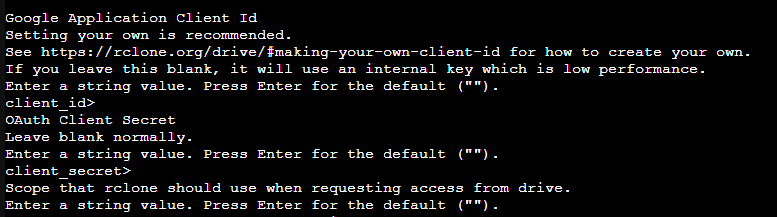
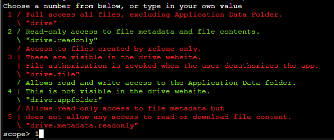
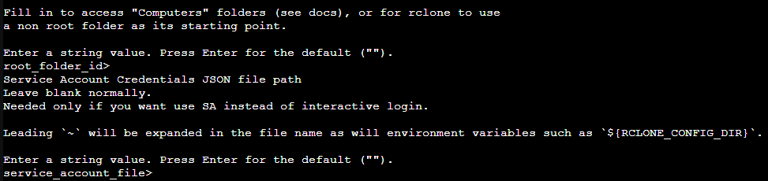
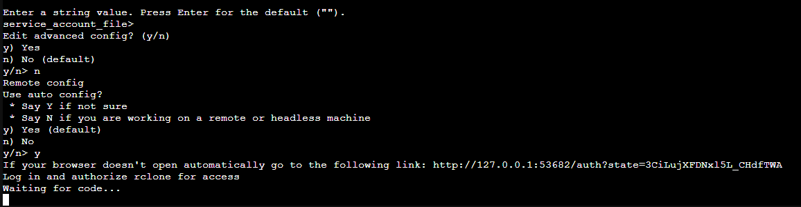

# Proxmox Backup rclone

1. #### Install rclone
```sh
  sudo -v ; curl https://rclone.org/install.sh | sudo bash
```

2. #### Konfigurasi rclone
```sh
  rclone config
```
&nbsp;&nbsp;&nbsp;&nbsp;&nbsp;&nbsp;&nbsp;&nbsp; a. ketik n untuk membuat remote baru dan beri nama:
<br />


&nbsp;&nbsp;&nbsp;&nbsp;&nbsp;&nbsp;&nbsp;&nbsp; b. ketik 13:
<br />


&nbsp;&nbsp;&nbsp;&nbsp;&nbsp;&nbsp;&nbsp;&nbsp; c. tekan enter:
<br />


&nbsp;&nbsp;&nbsp;&nbsp;&nbsp;&nbsp;&nbsp;&nbsp; d. ketik 1:
<br />


&nbsp;&nbsp;&nbsp;&nbsp;&nbsp;&nbsp;&nbsp;&nbsp; e. tekan enter:
<br />


&nbsp;&nbsp;&nbsp;&nbsp;&nbsp;&nbsp;&nbsp;&nbsp; f. ketik n dan y:
<br />


&nbsp;&nbsp;&nbsp;&nbsp;&nbsp;&nbsp;&nbsp;&nbsp; g. lakukan tunnel ssh ke 127.0.0.1:
<br />

